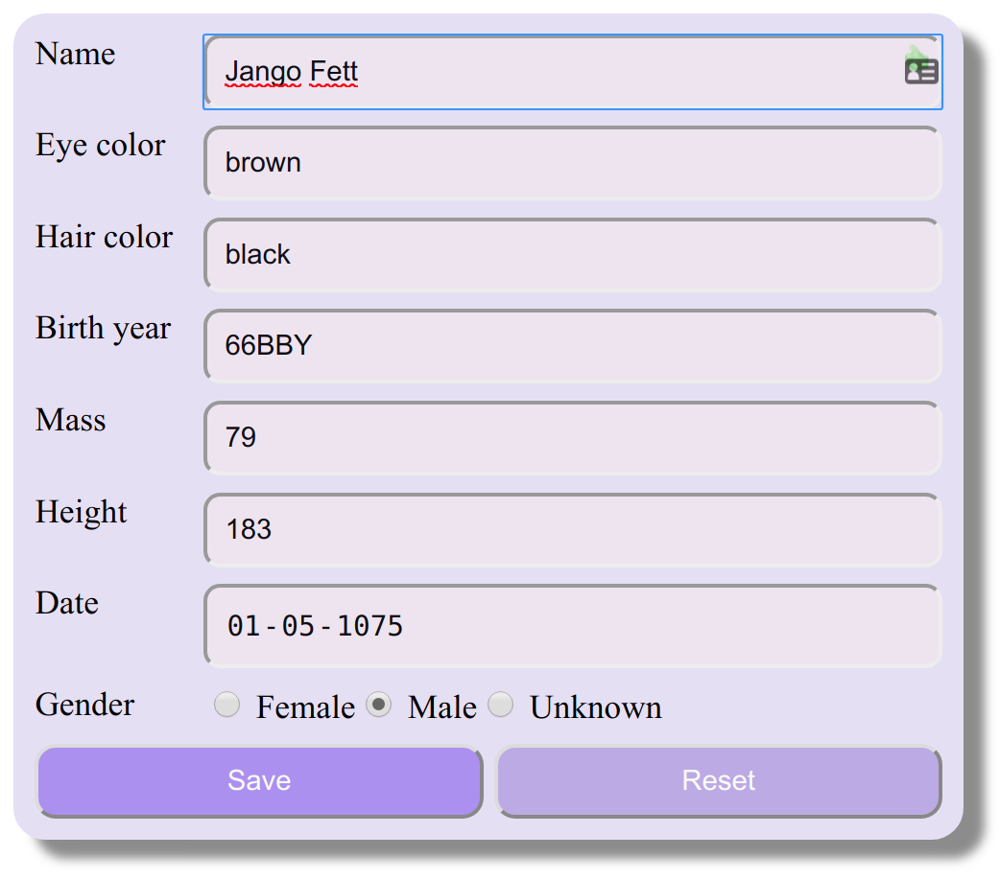

# seObservableForm

seObservableForm is an alternative form module for angular.
Key reasons for choosing this module.

1. Reduce complexity around forms
2. Provide an easy to use API
3. Fully immutable data flow.
4. Only reports changes.
5. Native HTML form elements.
6. Exposes the forms data as an observable stream

## Sample



### Template:
```HTML
<form (save)="doSave($event)" observable [fillForm]="person$ | async">
  <label>Name</label>
  <input type="text" name="name" minlength="2" required autofocus />

  <label>Eye color</label>
  <input type="text" name="eye_color" />

  <label>Hair color</label>
  <input type="text" name="hair_color" />

  <label>Birth year</label>
  <input type="text" name="birth_year" />

  <label>Mass</label>
  <input type="number" name="mass" />

  <label>Height</label>
  <input type="number" name="height" />

  <label>Date</label>
  <input type="date" name="date" />

  <label>Gender</label>
  <section>
    <label> <input type="radio" name="gender" value="female" /> Female</label>
    <label> <input type="radio" name="gender" value="male" /> Male</label>
    <label> <input type="radio" name="gender" value="n/a" /> Unknown</label>
  </section>
  <div class="buttons">
    <button type="submit">Save</button> <button type="reset">Reset</button>
  </div>
</form>
<div class="backDrop" *ngIf="!person"><h2>Loading</h2></div>
```

### Controller:
```typescript
export class DemoComponent {
  person$ = this.http.get('https://swapi.co/api/people/28')
  
  constructor(private http: HttpClient) {}

  doSave(formData) {
    console.log('Changes',formData);
  }
}
```

## Installation

For now, copy the `src/app/se-observable-form` into your project, and add the `SeObservableFormModule` to the `imports` array of your `app.module`. 
Soon I will publish the module to NPM
