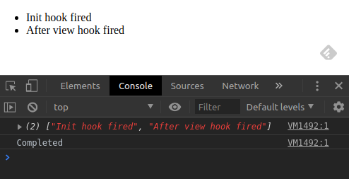

# Ivy Life Cycle Decorators

A typescript decorator to be able to use Angular life-cycle hooks in an observable way. Works with Ivy only.

## Sample:

```typescript
@Component({
  selector: 'app-life-hook-demo',
  template: `
    <ul>
      <li *ngFor="let item of showHooks$ | async">{{ item }}</li>
    </ul>
  `,
  styleUrls: ['./life-hook-demo.component.css']
})
export class LifeHookDemoComponent {
  @LifeCycleHook('onInit') init$: Observable<void>;
  @LifeCycleHook('afterViewInit') av$: Observable<void>;
  @LifeCycleHook('onDestroy') destroy$: Observable<void>;

  showHooks$ = combineLatest([this.init$, this.av$]).pipe(
    map(([init]) => ['Init hook fired', 'After view hook fired']),
    takeUntil(this.destroy$),
    tap({
      next: r => console.log(r),
      complete: () => console.log('Completed')
    })
  );
}
```

## Result:


